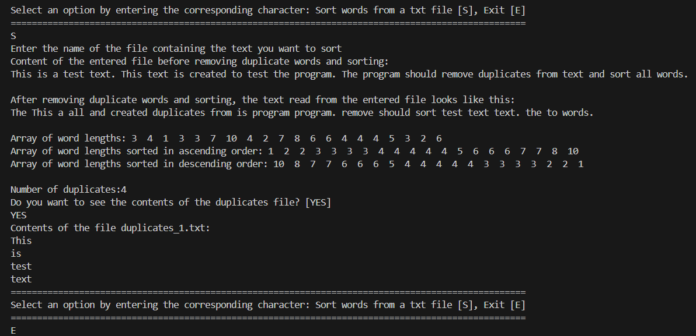

# AVLTreeWordSorter

## Project Overview

This project is an implementation of a word sorting program using an **AVL (Adelson-Velsky and Landis) tree** in C. It demonstrates multiple sorting techniques on text data. The program reads a text file, removes duplicate words, and sorts the remaining words lexicographically (alphabetically) using an AVL tree. Duplicate words are stored in a separate file named `duplicates.txt`. After sorting words using the AVL tree the program creates an array of word lengths and sorts it using **bubble sort** and **insertion sort** algorithms.

## Key Features

- **AVL Tree for Lexicographic Sorting:**  
  Words are inserted into an AVL tree to maintain balanced height and ensure efficient sorting. The tree automatically balances itself after each insertion to preserve the AVL property.

- **Duplicate Word Handling:**  
  The program counts occurrences of each word. Words that appear more than once are written to a separate duplicates file.

- **Multiple Sorting Techniques:**  
  After sorting words using the AVL tree (inorder traversal), the program creates an array of word lengths and sorts it:
  - Ascending order using **Bubble Sort**
  - Descending order using **Insertion Sort**

- **Case-Sensitive Sorting:**  
  Words are treated as case-sensitive (e.g., "Word" and "word" are considered different).

## Input Files

- **Text File (.txt):**  
  Contains the text to be sorted. The program reads the file, eliminates duplicates, and sorts the words lexicographically.

## Program Demonstration

Below are screenshot showcasing the program in action:

### How to Use the Program

1. Compile the program using a C compiler
2. Run the executable file.  
3. Choose the option to sort a text file.  
4. Provide the file name containing the text.  
5. View sorted words, word length arrays, and duplicates if any.

## Acknowledgements / Inspired by

This project was implemented for educational purposes as part of a Data Structures and Algorithms course.  

The AVL tree insertion and rotation logic was inspired by the tutorial: [AVL Tree - Programiz](https://www.programiz.com/dsa/avl-tree).